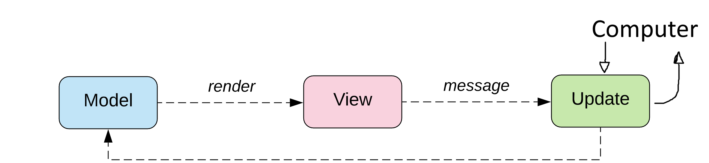

```{r setup, include=FALSE}
knitr::opts_chunk$set(echo = FALSE)
```

## Topics of this Talk

* Background
    * Introduction to Elm
    * Introduction to Refinement Types
    * Goals of the Thesis
* Formulizing the Elm language
    * Defining the Type system
    * Hindley-Milner Type System
    * Infering the Type of the Max Function
    * Quick introduction to K Framework
* Extending the Elm language
    * Defining Liquid types
    * Liquid Type Inference
    * The Inference Algorithm for Liquid Types
    * Revisiting the Max Function

## Background: Elm Programming Language

* Invented by Evan Czaplicki as his master-thesis in 2012.
* Goal: Bring Function Programming to Web-Development
* Side-Goal: Learning-friendly design decisions
* Website: \alert{elm-lang.org}

### Characteristics

* Pure Functional Language (immutable, no side effect, everything is a function)
* Compiles to JavaScript (in the future also to WebAssembly)
* ML-like Syntax (we say `fun a b c` for $fun(a,b,c)$)
* Simpler than Haskell (no Type classes, no Monads, only one way to do a given thing)
* "No Runtimes errors" (running out of memory, function equality and non-terminating functions still give runtime errors.)

## Background: The Elm Architecture

```{r gameGraph2, echo=FALSE, fig.align='center', out.width='100%'}

```

## Background: Refinement Types

Restricts the values of an existing type using a predicate.

Initial paper in 1991 by Tim Freeman and Frank Pfenning

* Initial concept was done in ML.
* Allows predicates with only $\land,\lor,=$, constants and basic pattern matching.
* Operates over algebraic types.
* Needed to specify **explicitly** all possible Values.
    
### Example
$$
\{ a:(\mathit{Bool},\mathit{Bool})\ | \ a=(\mathit{True},\mathit{False}) \lor a=(\mathit{False},\mathit{True})\}
$$
$$
\forall t.\{a:List \ t| a = Cons \ (b:t) \ (c:List \ t) \land c = Cons \ (d:t) \ [ \ ] \}
$$


## Background: Liquid Types

Liquid Types (Logically Quantified Data Types) introduced in 2008

* Invented by Patrick Rondan, Ming Kawaguchi and Ranji Jhala
* Initial concept done in OCaml. Later also C, Haskell and TypeScript.
* Operates over Integers and Booleans. Later also Tuples and Functions.
* Allows predicates with logical operators, comparisons and addition.

### Example
$$a:\{Bool\ |\ \mathit{True}\}\to \{\nu:Bool\ |\ (a\lor \nu) \land \neg (a\land \nu)\}$$
$$\begin{aligned}a:&\{\nu:\mathit{Int}\ | \ 0 \leq a\}\to b:\{\nu:\mathit{Int}\ |\ 0 \leq b\}\\
&\to\{\nu:Int\ |\  0\leq\nu \ \land \ a-b\leq\nu \ \land \ b-a\leq\nu \}\end{aligned}$$

## Goals of Thesis

1. Formal language similar to Elm
    1. A formal syntax
    2. A formal type system
    3. A denotational semantic
    4. A small step semantic (using K Framework) for rapid prototyping the language
    5. Proof that the type system is valid with respect to the semantics.
2. Extension of the formal language with Liquid Types
    1. Extending the formal syntax, formal type system and denotational semantic
    2. Proof that the extension infers the correct types.
    3. A Implementation (of the core algorithm) written in Elm for Elm.

## Theory: Formalization of the Elm Type System

We will use the Hindley-Milner type system (used in ML, Haskell and Elm)

We say
$$
\begin{aligned}
  T \text{ is a }\mathit{mono} \ \mathit{type}:\Leftrightarrow
       \ & T \text{ is a type variable}\\
  \lor \ & T \text{ is a type application}\\
  \lor \ & T \text{ is a algebraic type}\\
  \lor \ & T \text{ is a product type}\\
  \lor \ & T \text{ is a function type}\\
  T \text{ is a }\mathit{poly} \ \mathit{type} :\Leftrightarrow
       \ & T = \forall a.T'\\
         & \text{ where } T' \text{ is a mono type or poly type}\\
         & \text{ and } a \text{ is a symbol}\\
  T \text{ is a }\mathit{type} :\Leftrightarrow 
       \ & T \text{ is a mono type} \ \lor \ T \text{ is a poly type}.
\end{aligned}
$$  

## Theory: Formalization of the Elm Type System

### Example

1. $\mathit{Nat} ::= \mu C.1 \ | \ \mathit{Succ} \ C$
2. $\mathit{List} = \forall a.\mu C. \mathit{Empty} \ | \ \mathit{Cons} \ a \ C$
3. $\text{splitAt}:\forall a.\mathit{Nat} \rightarrow List \ a \rightarrow (List \ a,List \ a)$

## Theory: Formalization of the Elm Type System
The $values$ of a type is the set corresponding to the type:

$$\text{values}(\mathit{Nat}) = \{1,\mathit{Succ} \ 1, \mathit{Succ} \ \mathit{Succ} \ 1,\dots\}$$
$$\text{values}(\mathit{List} \ \mathit{Nat}) = \bigcup_{n\in\mathbb{N}} \text{values}_n(\mathit{List} \ \mathit{Nat})$$
$$\text{values}_0(List \ Nat) = \{[\ ]\}$$
$$\begin{aligned}
\text{values}_n&(List \ Nat) =\\
&\{[\ ]\}\cup\{Cons \ a \ b|a\in \text{values}(Nat),b\in \text{values}_{n-1}(\textit{List} \ \textit{Nat})\}
\end{aligned}$$


## Introduction To Elm: Hindley-Milner Type System
The $values$ of a type is the set corresponding to the type:

$$\text{values}(\mathit{Nat}) = \{1,\mathit{Succ} \ 1, \mathit{Succ} \ \mathit{Succ} \ 1,\dots\}$$
$$\text{values}(\mathit{List} \ \mathit{Nat}) = \bigcup_{n\in\mathbb{N}} \text{values}_n(\mathit{List} \ \mathit{Nat})$$
$$\text{values}_0(List \ Nat) = \{[\ ]\}$$
$$\begin{aligned}
\text{values}_n&(List \ Nat) =\\
&\{Cons \ a \ b|a\in \text{values}(Nat),b\in \text{values}_{n-1}(\textit{List} \ \textit{Nat})\}
\end{aligned}$$

## Introduction To Elm: Order of Types

Let $n,m\in\mathbb{N}$,
$T_1,T_2\in\mathcal{T}$,
$a_i$
for all $i\in\mathbb{N}_0^n$ and $b_i\in\mathcal{V}$ for all $i\in\mathbb{N}_0^m$.

We define the partial order $\sqsubseteq$ on poly types as
$$
\begin{aligned}
\forall a_1 \dots \forall a_n.T_1 &\sqsubseteq \forall b_1 \dots \forall b_m.T_2:\Leftrightarrow \\
  \exists \Theta &= \{(a_i,S_i) \ | \ i\in\mathbb{N}_1^n\land a_i\in\mathcal{V}\land
S_i\in\mathcal{T}\}.\\
  T_2&=[T_1]_\Theta \land \forall i\in\mathbb{N}_0^m.b_i\not\in\mathrm{free}(\forall a_1 \dots \forall a_n.T_1)
\end{aligned}
$$

Example: $\forall a. a \sqsubseteq \forall a. \mathit{List} \ a \sqsubseteq \mathit{List} \ \mathit{Nat}$

## Most General Type

\[\begin{aligned}
\overline{\Gamma}:&\Gamma \to \mathcal{T}\\
\overline{\Gamma}(T) := &\forall a_1 \dots \forall a_n.T_0\\
&\text{such that } \{a_1,\dots,a_n\}=\text{free}(T')\setminus \{a \ | \ (a,\_)\in\Gamma\}\\
& \text{where } a_i\in\mathcal{V} \text{ for } i\in\mathbb{N}_0^n \text{ and } T_0 \text{ is the mono type of } T.
\end{aligned}\]

We say $\overline{\Gamma}(T)$ is _the most general type_ of $T$.

## Type Inference: Infering the Type of the Max Function

```
max : Int -> Int -> Int;
max =
  \a -> \b ->
    if 
      (<) a b
    then
      b
    else
      a
```


## Type Inference: Infering the Type of the Max Function

$$
\frac
{(a,\overline{\Gamma}(T))\in\Delta
}
{\Gamma,\Delta\vdash a: T}
$$

New rules:

$$\frac
{}
{\Gamma,\Delta\cup\{(a,\overline{\Gamma}(T))\}\vdash a:T}\quad
\frac
{}{\Gamma,\Delta\cup\{(b,\overline{\Gamma}(T))\}\vdash b:T}$$

## Type Inference: Infering the Type of the Max Function

```
max : Int -> Int -> Int;
max =
  \a -> \b ->
    if 
      (<) a b 
    then
      b                   --> a1
    else
      a                   --> a2
```

## Type Inference: Infering the Type of the Max Function


$$
\frac
{}
{\Gamma,\Delta\vdash\mathtt{"(<)"}:\mathit{Int}\to \mathit{Int}\to\mathit{Bool}}
$$

$$
\frac
{\Gamma,\Delta\vdash e_1: T_1\to T_2\quad
\Gamma,\Delta\vdash e_2: T_1
}
{\Gamma,\Delta\vdash e_1 \ e_2: T_2}
$$

New rule:

$$
\frac
{\Gamma,\Delta\vdash e_1: \mathit{Int}\quad
\Gamma,\Delta\vdash e_2: \mathit{Int}
}
{\Gamma,\Delta\vdash \mathtt{"(<)"} \ e_1 \ e_2: \mathit{Bool}}
$$

## Type Inference: Infering the Type of the Max Function

$$\frac
{}
{\Gamma,\Delta\cup\{(\mathtt{a},\overline{\Gamma}(T))\}\vdash \mathtt{a}:T}\quad
\frac
{}{\Gamma,\Delta\cup\{(\mathtt{b},\overline{\Gamma}(T))\}\vdash \mathtt{b}:T}
$$

$$
\frac
{\Gamma,\Delta\vdash e_1: \mathit{Int}\quad
\Gamma,\Delta\vdash e_2: \mathit{Int}
}
{\Gamma,\Delta\vdash \mathtt{"(<)"} \ e_1 \ e_2: \mathit{Bool}}
$$

The most general type of $\mathit{Int}$ is $\mathit{Int}$

New rule:

$$
\frac
{}
{\Gamma,\Delta\cup\{(\mathtt{a},\mathit{Int}),(\mathtt{b},\mathit{Int})\}\vdash \mathtt{"(<)} \ \mathtt{a} \ \mathtt{b"}: \mathit{Bool}}
$$

## Type Inference: Infering the Type of the Max Function

```
max : Int -> Int -> Int;
max =
  \a -> \b ->
    if 
      (<) a b             --> Bool
    then
      b                   --> Int
    else
      a                   --> Int
```

## Type Inference: Infering the Type of the Max Function

$$
\frac
{}
{\Gamma,\Delta\cup\{(a,\mathit{Int}),(b,\mathit{Int})\}\vdash \mathtt{"(<)"} \ e_1 \ e_2: \mathit{Bool}}
$$

$$
\frac
{
\Gamma,\Delta\vdash e_1:\textit{Bool}\quad
\Gamma,\Delta\vdash e_2: T\quad
\Gamma,\Delta\vdash e_3: T
}
{\Gamma,\Delta\vdash\mathtt{"if"} \ e_1  \ \mathtt{"then"} \ e_2 \ \mathtt{"else"} \ e_3:T}
$$

New rule:

$$
\frac
{}
{\Gamma,\Delta\cup\{(a,\mathit{Int}),(b,\mathit{Int})\}\vdash\mathtt{"if (<)} \ \mathtt{a}\ \mathtt{b}\ \mathtt{then} \ \mathtt{b} \ \mathtt{else} \ \mathtt{a"}:\mathit{Int}}
$$

## Type Inference: Infering the Type of the Max Function

```
max : Int -> Int -> Int;
max =
  \a -> \b ->
    if                    --> Int
      (<) a b
    then
      b                   --> Int
    else
      a                   --> Int
```

## Type Inference: Infering the Type of the Max Function

$$
\frac
{\Gamma,\Delta\cup\{(a,\overline{\Gamma}(T_1))\}\vdash e: T_2
}
{\Gamma,\Delta\vdash\mathtt{"\textbackslash"} \ a \ \mathtt{"->"} \ e: T_1\to T_2}
$$

The most general type of $\mathit{Int}$ is $\mathit{Int}$

## Type Inference: Infering the Type of the Max Function

Therefore we conclude

$$
\frac
{}
{\Gamma,\Delta\cup\{(a,\mathit{Int})\}\vdash\mathtt{"}\mathtt{\textbackslash b->}\mathtt{if}\ \mathtt{(<)} \ \mathtt{a}\ \mathtt{b}\ \mathtt{then} \ \mathtt{b} \ \mathtt{else} \ \mathtt{a"}:\mathit{Int}\to \mathit{Int}}
$$

$$
\frac
{}
{\Gamma,\Delta\vdash\mathtt{"}\mathtt{\textbackslash a->}\mathtt{\textbackslash b->}\mathtt{if}\ \mathtt{(<)} \ \mathtt{a}\ \mathtt{b}\ \mathtt{then} \ \mathtt{b} \ \mathtt{else} \ \mathtt{a"}:\mathit{Int}\to\mathit{Int}\to \mathit{Int}}
$$

## Type Inference: Infering the Type of the Max Function

```
max : Int -> Int -> Int;
max =                     --> Int -> Int -> Int
  \a -> \b ->
    if                    --> Int
      (<) a b
    then
      b                   --> Int
    else
      a                   --> Int
```
## K Framework

* Created in 2003 by Grigore Rosu
* Maintained and developed by the research groups FSL (Illinois,USA) and FMSE (Lasi,Romania).
* Framework for designing and formalizing programming languages.
* Based on Rewriting systems.

## K Framework - K File

```
require "unification.k"
require "elm-syntax.k"

module ELM-TYPESYSTEM
  imports DOMAINS
  imports ELM-SYNTAX

  configuration <k> $PGM:Exp </k>
                <tenv> .Map </tenv>
  //..
  
  syntax KResult ::= Type
endmodule
```


## K Framework - Syntax

`syntax` denotes a syntax

* `strict` - Evaluate the inner expression first
* `right/left` - Evaluate left/right expression first
* `bracket` - Notation for Brackets

```
syntax Type
  ::= "bool"
    | "int"
    | "{}Type"
    | "{" ListTypeFields "}Type" [strict]
    | Type "->" Type       [strict,right]
    | LowerVar
    | "(" Type ")"              [bracket]
    | ..
```

## K Framework - Rules

* rules will be executed top to bottom
* `rule . => .` denotes a rewriting rule
* ` . ~> . ` denotes a concatenation of two processes(KItems)
* `.` denotes the empty process (`rule . ~> A => A`)
* `requires` denotes a precondition to the rule
* `?T` denotes an existentially quantified variable

```
syntax Exp ::= Type
rule E1:Type E2:Type
  => E1 =Type (E2 -> ?T:Type)
    ~> ?T
syntax KResult ::= Type
```

## Example for Formally Inferring the Type

```
let
  model = []
in
((::) 1) model
```

\begin{description}
\item[0.] $\Gamma:=\varnothing, \Delta:=\varnothing$
\item[{[List] 1.}] $\Gamma,\Delta\vdash \mathtt{[]}:\forall a.\mathit{List} \ a$
\item[{[LetIn] 2.}] $\Delta := \Delta\cup(model \mapsto\forall a.\mathit{List} \ a)$
\item[{[Int] 3.}] $\Gamma,\Delta\vdash 1:\mathit{Int}$
\item[{[Call] 4.}] $\Gamma,\Delta\vdash \mathtt{(::) \ 1}:\mathit{List} \ \mathit{Int}\to \mathit{List} \ \mathit{Int}$
\item[{[Variable] 5.}] $\Gamma,\Delta\vdash \mathit{model}:\forall a.\mathit{List} \ a$
\item[{[Call] 6.}] $\Gamma,\Delta\vdash \mathtt{((::) \ 1) \ \mathit{model}}:\mathit{List} \ \mathit{Int}$
\end{description}

## Formal Inference Rules - List

```
rule []Exp => list ?A:Type
```

```
<k>
let
  model = list ?A0:Type
in
((::) (intExp 1)) (variable model)
</k>
<tenv> .Map </tenv>
```

## Formal Inference Rules - LetIn

```
rule <k> let X = T:Type in E => E ~> setTenv(TEnv) 
  ...</k>
  <tenv> TEnv 
    => TEnv[ X 
      <- forall 
        (#metaKVariables(T) 
          -Set #metaKVariables(setTenv(TEnv)))
        . 
        ( #freezeKVariables(T, setTenv(TEnv)):>Type)
      ]
  </tenv>
```

```
<k>((::) (intExp 1)) (variable model)</k>
<tenv> [model <- forall A0 . (list (#freeze(A0))]</tenv>
```

## Formal Inference Rules - Cons, Int

```
rule (::) => ?A:Type -> ( list ?A ) -> ( list ?A )

rule intExp I:Int => int
```

```
<k>
((?A1:Type -> ( list ?A1 ) -> ( list ?A1 )) int) 
  (variable model)
</k>
<tenv>
  [model <- forall A0 . (list (#freeze(A0))]
</tenv>
```

## Formal Inference Rules - Apply

```
rule E1:Type E2:Type => E1 =Type (E2 -> ?T:Type) ~> ?T
```

```
<k>
(( list int ) -> ( list int )) (variable model)
</k>
<tenv>
  [model <- forall A0 . (list (#freeze(A0))]
</tenv>
```

## Formal Inference Rules - Variable

```
rule <k> variable X:Id => #renameMetaKVariables(T, Tvs) 
    ...</k>
    <tenv>... X |-> forall Tvs . T
    ...</tenv>
```

```
<k>
(( list int ) -> ( list int )) (list ?A2)
</k>
<tenv>
  [model <- forall A0 . (list (#freeze(A0))]
</tenv>
```

## Formal Inference Rules - Apply

```
<k>
list int
</k>
<tenv>
  [model <- forall A0 . (list (#freeze(A0))]
</tenv>
```

## Introduction to Liquid Types: Refinement Types

Restricts the values of an existing type using a predicate.

Initial paper in 1991 by Tim Freeman and Frank Pfenning

* Initial concept was done in ML.
* Allows predicates with only $\land,\lor,=$, constants and basic pattern matching.
* Operates over algebraic types.
* Needed to specify **explicitly** all possible Values.
    
### Example
$$
\{ a:(\mathit{Bool},\mathit{Bool})| \ a=(\mathit{True},\mathit{False}) \lor a=(\mathit{False},\mathit{True})\}
$$


## Introduction to Liquid Types: Liquid Types

Liquid Types (Logically Quantified Data Types) introduced in 2008

* Invented by Patrick Rondan, Ming Kawaguchi and Ranji Jhala
* Initial concept done in OCaml. Later also C, Haskell and TypeScript.
* Operates over Integers and Booleans. Later also Tuples and Functions.
* Allows predicates with logical operators, comparisons and addition.

## Example

$$a:\mathit{Bool}\to b:\mathit{Bool}\to\{\nu:\mathit{Bool}|\nu = (a\lor b) \land \neg (a\land b)\}$$
$$
\begin{aligned}
a:\mathit{Int}\to b:\mathit{Int}\to\{&\nu:\mathit{Int}\\
|\ &(\nu = a \land \nu > b)\\
\lor &(\nu = b \land \nu > a)\\
\lor &(\nu = a \land \nu = b)\}
\end{aligned}
$$

$$(/):\mathit{Int} \rightarrow \{\nu:\mathit{Int}|\neg (\nu = 0)\} \rightarrow \mathit{Int}$$

## Introduction to Liquid Types: Logical Qualifier Expressions

$$
  \small\begin{aligned}
    \mathit{IntExp} ::= \ & \mathbb{Z}\\
      | \ & \mathit{IntExp} + \mathit{IntExp}\\
      | \ & \mathit{IntExp} \cdot \mathbb{Z}\\
      | \ & \mathcal{V}
  \end{aligned}
$$

$$
  \small\begin{aligned}
    \mathcal{Q} ::= \ & \mathit{True}\\
      | \ & \mathit{False}\\
      | \ & \mathit{IntExp} < \mathcal{V}\\
      | \ & \mathcal{V} < \mathit{IntExp}\\
      | \ & \mathcal{V} = \mathit{IntExp}\\
      | \ & \mathcal{Q} \land \mathcal{Q}\\
      | \ & \mathcal{Q} \lor \mathcal{Q}\\
      | \ & \neg \mathcal{Q}
  \end{aligned}
$$

## Introduction to Liquid Types: Defining Liquid Types

$$
\begin{aligned}
T \text{ is a }\mathit{liquid} \ \mathit{type} \ :\Leftrightarrow \ 
         & T \text{ is of form } \{ a :\mathit{Int} \ | \ r \}\\
         & \text{where } T_0\text{ is a type}, a \text{ is a symbol, }r\in \mathcal{Q},\\
         & \mathit{Nat}:=\mu C. 1 \ | \ \mathit{Succ} \ C\\
&\text{and }\mathit{Int}:=\mu \_. 0 \ | \ \mathit{Pos} \ Nat \ | \ \mathit{Neg} \ \mathit{Nat}.\\
  \lor \ & T \text{ is of form } a:\{ b :\mathit{Int} \ | \ r \}\to \hat{T}\\
         & \text{where } a,b \text{ are symbols}, r\in \mathcal{Q}, \hat{T} \text{ and } \hat{T}_1\
\text{ are}\\
          &\text{liquid types.}\\
         \end{aligned}
$$

## The Inference Algorithm: Definitions

### Subtyping Condition

$$
\begin{aligned}
\text{We say }&c\text{ is a }\mathit{Subtyping} \ \mathit{Condition}:\Leftrightarrow c \text{ is of form }\hat{T}_1<:_{\Theta,\Lambda}\hat{T}_2\\
&\text{where }\hat{T}_1,\hat{T}_2\text{ are a liquid types or templates},\Theta\text{ is a type}\\
&\text{variable context and } \Lambda\subset\mathcal{Q}.
\end{aligned}
$$

## Liquid Type Inference: Infering the Type of the Max Function

```
max : a:{ v:Int|True } -> b:{ v:Int|True }
  -> { v:Int | (||) ((&&) ((=) v a) ((>) v b))
             ( (||) ((&&) ((=) v b) ((>) v a))
                    ((&&) ((=) v a) ((=) v b))
             ) };
max =
  \a -> \b ->
    if 
      (<) a b
    then
      b
    else
      a
```

## Liquid Type Inference: Infering the Type of the Max Function

$$
\frac
{\begin{gathered}
\{\nu:\hat{T}| \ \nu = a\}<:_{\Theta,\Lambda}\{\nu:\hat{T}| \ r\}\\
(a,\{\nu:\hat{T}| \ r\}) \in \Delta\quad
(a,\{\nu:\hat{T}| \ r\}) \in \Theta
\end{gathered}
}
{\Gamma,\Delta,\Theta,\Lambda\vdash a: \{\nu:\hat{T}| \ \nu = a\}}{}
$$

New rule:

$$
\frac
{\begin{gathered}
\{\nu:\hat{T}| \ \nu = \mathtt{a}\}<:_{\Theta,\Lambda}\{\nu:\hat{T}| \ r\}\\
(\mathtt{a},\{\nu:\hat{T}| \ r\}) \in \Delta\quad
(\mathtt{a},\{\nu:\hat{T}| \ r\}) \in \Theta
\end{gathered}
}
{\Gamma,\Delta,\Theta,\Lambda\vdash \mathtt{a}: \{\nu:\hat{T}| \ \nu = \mathtt{a}\}}{}
$$
$$
\frac
{\begin{gathered}
\{\nu:\hat{T}| \ \nu = \mathtt{b}\}<:_{\Theta,\Lambda}\{\nu:\hat{T}| \ r\}\\
(\mathtt{b},\{\nu:\hat{T}| \ r\}) \in \Delta\quad
(\mathtt{b},\{\nu:\hat{T}| \ r\}) \in \Theta
\end{gathered}
}
{\Gamma,\Delta,\Theta,\Lambda\vdash \mathtt{b}: \{\nu:\hat{T}| \ \nu = b\}}{}
$$

## Liquid Type Inference: Infering the Type of the Max Function

```
max : a:{ v:Int|True } -> b:{ v:Int|True }
  -> { v:Int | (||) ((&&) ((=) v a) ((>) v b))
             ( (||) ((&&) ((=) v b) ((>) v a))
                    ((&&) ((=) v a) ((=) v b))
             ) };
max =
  \a -> \b ->
    if 
      (<) a b
    then
      b       --> {v:Int| True }
    else
      a       --> {v:Int| True }
```

## Liquid Type Inference: Infering the Type of the Max Function

```
max : a:{ v:Int|True } -> b:{ v:Int|True }
  -> { v:Int | (||) ((&&) ((=) v a) ((>) v b))
             ( (||) ((&&) ((=) v b) ((>) v a))
                    ((&&) ((=) v a) ((=) v b))
             ) };
max =
  \a -> \b ->
    if 
      (<) a b --> Bool
    then
      b       --> {v:Int| True }
    else
      a       --> {v:Int| True }
```

## Liquid Type Inference: Infering the Type of the Max Function

$$
\frac
{}
{\Gamma,\Delta\cup\{(\mathtt{a},\{\nu:\mathit{Int}| \ r_0\}),(\mathtt{b},\{\nu:\mathit{Int}| \ r_1\})\},\Theta,\Lambda\vdash \mathtt{"(<)"} \ e_1 \ e_2: \mathit{Bool}}
$$

$$
\frac
{
\begin{gathered}
\Gamma,\Delta,\Theta,\Lambda\vdash e_1:\textit{Bool}\quad
e_1:e_1'\\
\Gamma,\Delta,\Theta,\Lambda\cup\{e_1'\}\vdash e_2: \hat{T}\quad
\Gamma,\Delta,\Theta,\Lambda\cup\{\neg e_1'\}\vdash e_3: \hat{T}
\end{gathered}
}
{\Gamma,\Delta,\Theta,\Lambda\vdash\mathtt{"if"} \ e_1  \ \mathtt{"then"} \ e_2 \ \mathtt{"else"} \ e_3:\hat{T}}
$$

New rule:

$$
\frac
{
\begin{gathered}
\{(a,\{\nu:\mathit{Int}|r_0\}),(b,\{\nu:\mathit{Int}|r_1\})\}\in\Delta\\
\Gamma,\Delta,\Theta,\Lambda\cup\{a<b\}\vdash \mathtt{b}: \{\nu:\mathit{Int}|r_2\}\\
\Gamma,\Delta,\Theta,\Lambda\cup\{\neg(a<b)\}\vdash \mathtt{a}: \{\nu:\mathit{Int}|r_2\}
\end{gathered}
}
{\Gamma,\Delta,\Theta,\Lambda\vdash\mathtt{"if"} \ \mathtt{a<b}  \ \mathtt{"then"}\mathtt{b} \ \mathtt{"else"} \ \mathtt{a}:\{\nu:\mathit{Int}|r_2\}}
$$

## Liquid Type Inference: Infering the Type of the Max Function

$$
\frac
{\begin{gathered}
\{\nu:\hat{T}| \ \nu = \mathtt{a}\}<:_{\Theta,\Lambda}\{\nu:\hat{T}| \ r\}\\
(\mathtt{a},\{\nu:\hat{T}| \ r\}) \in \Delta\quad
(\mathtt{a},\{\nu:\hat{T}| \ r\}) \in \Theta
\end{gathered}
}
{\Gamma,\Delta,\Theta,\Lambda\vdash \mathtt{a}: \{\nu:\hat{T}| \ \nu = \mathtt{a}\}}{}
$$
$$
\frac
{\begin{gathered}
\{\nu:\hat{T}| \ \nu = \mathtt{b}\}<:_{\Theta,\Lambda}\{\nu:\hat{T}| \ r\}\\
(\mathtt{b},\{\nu:\hat{T}| \ r\}) \in \Delta\quad
(\mathtt{b},\{\nu:\hat{T}| \ r\}) \in \Theta
\end{gathered}
}
{\Gamma,\Delta,\Theta,\Lambda\vdash \mathtt{b}: \{\nu:\hat{T}| \ \nu = b\}}{}
$$

$$
\frac
{
\begin{gathered}
\{(a,\{\nu:\mathit{Int}|r_0\}),(b,\{\nu:\mathit{Int}|r_1\})\}\in\Delta\\
\Gamma,\Delta,\Theta,\Lambda\cup\{a<b\}\vdash \mathtt{b}: \{\nu:\mathit{Int}|r_2\}\\
\Gamma,\Delta,\Theta,\Lambda\cup\{\neg(a<b)\}\vdash \mathtt{a}: \{\nu:\mathit{Int}|r_2\}
\end{gathered}
}
{\Gamma,\Delta,\Theta,\Lambda\vdash\mathtt{"if"} \ \mathtt{a<b}  \ \mathtt{"then"}\mathtt{b} \ \mathtt{"else"} \ \mathtt{a}:\{\nu:\mathit{Int}|r_2\}}
$$

## Liquid Type Inference: Infering the Type of the Max Function

**Subtyping Rule**

$$
\frac
{\Gamma,\Delta,\Theta,\Lambda\vdash e:\hat{T}_1\quad
\hat{T}_1<:_{\Theta,\Lambda}\hat{T}_2\quad
\text{wellFormed}(\hat{T}_2,\Theta)
}
{\Gamma,\Delta,\Theta,\Lambda\vdash e:\hat{T}_2}
$$

$$
\begin{aligned}
\{a_1:\mathit{Int}| r_1 \} <:_{\Theta,\Lambda}& \{ a_2 : \mathit{Int}| r_2\} \ :\Leftrightarrow \\ &\text{Let} \ \{(b_1,T_1),\dots,(b_n,T_n)\}=\Theta \ \text{in}\\
&\forall k_1\in\text{value}_\Gamma(T_1).\dots \forall k_n\in\text{value}_\Gamma(T_n).\\
&\forall n\in\mathbb{N}.\forall e \in\Lambda.\\
                                                                                  &\quad [[e]]_{\{(a_1,n),(b_1,k_1),\dots,(b_n,k_n)\}}\\
   &\quad\land [[r_1]]_{\{(a_1,n),(b_1,k_1),\dots,(b_n,k_n)\}}\\
                                                                                  &\Rightarrow[[r_2]]_{\{(a_2,n),(b_1,k_1),\dots,(b_n,k_n)\}}
                                                                                  \end{aligned}
$$

## Liquid Type Inference: Infering the Type of the Max Function

Find $r_2\in\mathcal{Q}$ such that

$$[[((a < b) \land \nu = b )\Rightarrow r_2]]_{\{(a,\{\nu:\mathit{Int}| r_0 \}),(b,\{\nu:\mathit{Int}| r_1 \})\}}$$

and

$$[[(\neg(a < b) \land \nu = a) \Rightarrow r_2]]_{\{(a,\{\nu:\mathit{Int}| r_0 \}),(b,\{\nu:\mathit{Int}| r_1 \})\}}$$

are valid.

Use SMT-Solver to find a solution.

Sharpest solution: $r_2 := ((a < \nu \land \nu = b) \lor (\neg(\nu < b) \land \nu = a))$

### Template

$$
\begin{aligned}
       \text{We say }&\hat{T}\text{ is a }\mathit{template}:\Leftrightarrow \hat{T} \text{ is of form } \{\nu:\mathit{Int}\ |\ [k]_S\}\\
         &\text{where } k\in\mathcal{K} \text{ and } S:\mathcal{V}\nrightarrow\mathcal{Q}\\
  \lor \ & \hat{T} \text{ is of form } a:\{\nu:\mathit{Int}\ |\ [k]_S\}\to\hat{T}\\
         &\text{where } k\in\mathcal{K}, \hat{T} \text{ is a template and } S:\mathcal{V}\nrightarrow\mathit{IntExp}.\\
\end{aligned}
$$

We define $\mathcal{K}:=\{\kappa_i \ | \ i\in\mathbb{N}\}$.

## The Inference Algorithm

$$
\begin{aligned}
&\text{Infer}:\mathcal{P}(\mathcal{C})\to\ (\mathcal{K}\nrightarrow \mathcal{Q})\\
&\text{Infer}(C)=\\
&\quad\begin{aligned}\text{Let}\
V:=&\bigcup_{\hat{T}_1<:_{\Theta,\Lambda}\hat{T}_2\in C}\{a \ | \ (a,\_)\in\Theta\}\\
Q_0:=&\mathit{Init}(V),\\
A_0:=&\{(\kappa,Q_0)\ | \ \kappa\in\bigcup_{c\in C}\text{Var}(c)\},\\
A:=&\text{Solve}(\bigcup_{c\in C} \text{Split}(c),A_0)\end{aligned}\\
&\quad\text{in } \{(\kappa,\bigwedge Q) \ | \ (\kappa,Q)\in A\}\\
\end{aligned}
$$

## The Inference Algorithm: Step 1 (Split)

$$
\begin{aligned}
&\text{Split}:\mathcal{C}\nrightarrow\mathcal{P}(\mathcal{C^-})\\
&\text{Split}(a:\{\nu:\mathit{Int}|q_1\}\to \hat{T}_2<:_{\Theta,\Lambda}a:\{\nu:\mathit{Int}|q_3\}\to\hat{T}_4 )=\\
&\quad\quad\{\{\nu:\mathit{Int}|q_3\} <:_{\Theta,\Lambda}\{\nu:\mathit{Int}|q_1\}\}\cup\text{Split}(\hat{T}_2 <:_{\Theta\cup\{(a,q_3)\},\Lambda}\hat{T}_4\})\\
&\text{Split}(\{\nu:\mathit{Int}|q_1\}<:_{\Theta,\Lambda}\{\nu:\mathit{Int}|q_2\} )=\\
&\quad\quad\{ \{\nu:\mathit{Int}|q_1\}<:_{\Theta,\Lambda}\{\nu:\mathit{Int}|q_2\} \}
\end{aligned}
$$

$\mathcal{C}:=\{c \ | \ c \text{ is a subtyping condition}\}$

$$
\begin{aligned}
\mathcal{C}^-:=\{&\ \{\nu:\mathit{Int}|q_1\}<:_{\Theta,\Lambda}\{\nu:\mathit{Int}|q_2\}\\
| \ &(q_1\in\mathcal{Q}\lor q_1=[k_1]_{S_1} \text{ for } k_1\in\mathcal{K}, S_1\in\mathcal{V}\nrightarrow\mathit{IntExp})\\
\land &(q_2\in\mathcal{Q}\lor q_2=[k_2]_{S_2} \text{ for } k_2\in\mathcal{K}, S_2\in\mathcal{V}\nrightarrow\mathit{IntExp})\}.
\end{aligned}$$

## The Inference Algorithm: Step 2 (Solve)

$$
{\tiny\begin{aligned}
\mathit{Init}:\mathcal{P}(\mathcal{V})\to&\mathcal{P}(\mathcal{Q})\\
\mathit{Init}(V)::=& \{0 < \nu\}\\
      &\cup \{a < \nu \ | \ a\in V\}\\
      &\cup \{\nu < 0\}\\
      &\cup \{\nu < a \ | \ a\in V\}\\
      &\cup \{\nu = a \ | \ a\in V\}\\
      &\cup \{\nu = 0\}\\
      &\cup \{a < \nu \lor \nu = a \ | \ a\in V\}\\
      &\cup \{\nu < a \lor \nu = a \ | \ a\in V\}\\
      &\cup \{0 < \nu \lor \nu = 0 \}\\
      &\cup \{\nu < 0 \lor \nu = 0 \}\\
      &\cup \{\neg (\nu = a) \ | \ a\in V \}\\
      &\cup \{\neg (\nu = 0)\}\\
\end{aligned}}
$$

## The Inference Algorithm: Step 2 (Solve)

$$
\begin{aligned}
\text{Solve}&:\mathcal{P}(\mathcal{C}^-)\times(\mathcal{K}\nrightarrow\mathcal{P}(\mathcal{Q}))\to(\mathcal{K}\nrightarrow\mathcal{P}(\mathcal{Q}))\\
\text{Solve}&(C,A)=\\
&\text{Let } S:=\{(k,\bigwedge Q) \ | \ (k,Q)\in A\}.\\
&\text{If there exists } (\{\nu:\mathit{Int}\ |\ q_1\}<:_{\Theta,\Lambda}\{\nu:\mathit{Int}\ |\ [k_2]_{S_2}\})\in C \text{ such that }\\
&\quad\neg (\forall z \in \mathbb{Z}.\forall i_1\in\text{value}_\Gamma(\{\nu:\mathit{Int}|r_1'\}).\dots \forall i_n\in\text{value}_\Gamma(\{\nu:\mathit{Int}|r_n'\}).\\
&\quad\quad[[r_1\land p]]_{\{(\nu,z),(b_1,i_1),\dots,(b_n,i_n)\}}\Rightarrow [[r_2]]_{\{(\nu,z),(b_1,i_1),\dots,(b_n,i_n)\}})\\
&\text{then } \text{Solve}(C,\text{Weaken}(c,A)) \text{ else } A
\end{aligned}
$$

### SMT statement:

$$((\bigwedge_{j=0}^n [r_j']_{\{(\nu,b_j)\}})\land r_1\land p)\land \neg r_2$$
with free variables $\nu\in\mathbb{Z}$ and $b_i\in\mathbb{Z}$ for $i\in\mathbb{N}_1^n$.

## The Inference Algorithm: Step 3 (Weaken)

$$
{\small\begin{aligned}
&\text{Weaken}:\mathcal{C}^-\times(\mathcal{K}\nrightarrow\mathcal{P}(\mathcal{Q}))\nrightarrow(\mathcal{K}\nrightarrow\mathcal{P}(\mathcal{Q}))\\
&\text{Weaken}(\{\nu:\mathit{Int}| x \} <:_{\Theta,\Lambda} \{\nu:\mathit{Int}| [k_2]_{S_2}\},A) =\\
&\quad\begin{aligned}\text{Let }&S:=\{(k,\bigwedge Q) \ | \ (k,Q)\in A\},\\
&\begin{aligned}Q_2 := \{\ &q \\
| \ &q\in A(k_2)\\
\land & (\forall z \in \mathbb{Z}.\forall i_1\in\text{value}_\Gamma(\{\nu:\mathit{Int}|r_1'\}).\dots \forall i_n\in\text{value}_\Gamma(\{\nu:\mathit{Int}|r_n'\}).\\
&\quad[[r_1\land p]]_{\{(\nu,z),(b_1,i_1),\dots,(b_n,i_n)\}}\Rightarrow[[[q]_{S_2}]]_{\{(\nu,z),(b_1,i_1),\dots,(b_n,i_n)\}})\}
\end{aligned}\end{aligned}\\
&\quad\text{in }\{(k,Q)\ |\ (k,Q)\in A \land k \neq k_2\}\cup\{(k_2,Q_2)\}\\
\end{aligned}}
$$

### SMT statement:

$$\neg((\bigwedge_{j=0}^n [r_j']_{\{(\nu,b_j)\}})\land r_1\land p)\lor r_2
$$
with free variables $\nu\in\mathbb{Z}$ and $b_i\in\mathbb{Z}$ for $i\in\mathbb{N}_1^n$ and $r_2 := [q]_{S_2}$.


## Current State

**Started thesis** in July 2019

**Expected finish** in April 2021