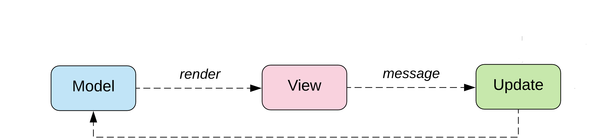
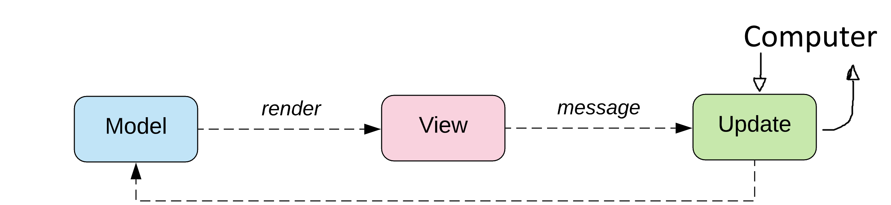

```{r setup, include=FALSE}
knitr::opts_chunk$set(echo = FALSE)
```

## Current State

1. Formal language similar to Elm
    1. A formal syntax **(DONE)**
    2. A formal type system **(DONE)**
    3. A denotational semantic **\alert{(DONE)}**
    4. A small step semantic (using K Framework)  
        **\alert{(WORK IN PROGRESS)}**
    5. Proof that the type system is valid with respect to the semantics.
2. Extension of the formal language with Liquid Types
3. A type checker implementation written in Elm for Elm.

## Topics of this Talk

* Quick introduction to K Framework
* Discuss the formal inference rules based on an example
* Compare the implemented type checker in K Framework with the formal type system
* Live demonstration using the given example.

## K Framework

* Created in 2003 by Grigore Rosu
* Maintained and developed by the research groups FSL (Illinois,USA) and FMSE (Lasi,Romania).
* Framework for designing and formalizing programming languages.
* Based on Rewriting systems.

## K Framework - K File

```
require "unification.k"
require "elm-syntax.k"

module ELM-TYPESYSTEM
  imports DOMAINS
  imports ELM-SYNTAX

  configuration <k> $PGM:Exp </k>
                <tenv> .Map </tenv>
  //..
  
  syntax KResult ::= Type
endmodule
```


## K Framework - Syntax

`syntax` denotes a syntax

* `strict` - Evaluate the inner expression first
* `right/left` - Evaluate left/right expression first
* `bracket` - Notation for Brackets

```
syntax Type
  ::= "bool"
    | "int"
    | "{}Type"
    | "{" ListTypeFields "}Type" [strict]
    | Type "->" Type       [strict,right]
    | LowerVar
    | "(" Type ")"              [bracket]
    | ..
```

## K Framework - Rules

* rules will be executed top to bottom
* `rule . => .` denotes a rewriting rule
* ` . ~> . ` denotes a implication
* `requires` denotes a precondition to the rule
* `?T` deontes an existencially quantified variable

```
syntax Exp ::= Type
rule E1:Type E2:Type
  => E1 =Type (E2 -> ?T:Type)
    ~> ?T
syntax KItem ::= Type
```

## Example for Formally Infering the Type

```
let
  model : { counter : Int };
  model = { counter = 0 }
in
{ model | counter = model.counter |> (+) 1 }
```

\begin{description}
\item[0.] $\Gamma:=\varnothing, \Delta:=\varnothing$
\item[{[Int] 1.}] $\Gamma,\Delta\vdash \mathtt{0}:Int$
\item[{[Record] 2.}] $\Gamma,\Delta\vdash \mathtt{\{ counter = 0 \}}:\{ counter : Int \}$
\item[{[LetIn] 3.}] $\Delta := \Delta\cup(model \mapsto\{counter:Int\})$
\item[{[Call] 4.}] $\Gamma,\Delta\vdash \mathtt{(+) \ 1}:Int\to Int$
\item[{[Getter] 5.}] $\Gamma,\Delta\vdash \mathtt{model.counter}:Int$
\item[{[Pipe] 6.}] $\Gamma,\Delta\vdash \mathtt{model.counter \ |> \ (+) \ 1}:Int$
\item[{[Setter] 7.}] $\Gamma,\Delta\vdash \Delta(model) "\supseteq" \{ counter = Int \}$ 
\end{description}

## Formal Inference Rules - Int, Pipe

$$
\frac
{i:T}
{\Gamma,\Delta\vdash i:T}
\quad
\frac
{}
{i:\mathit{Int}}
{}
$$
```
rule i:Bool => bool
```
$$
\frac
{
\Gamma,\Delta\vdash e_1: T_1\quad
\Gamma,\Delta\vdash e_2: T_1 \to T_2
}
{\Gamma,\Delta\vdash e_1 \ \mathtt{"|>"} \ e_2:T_2}
$$
```
rule E1:Type |> E2:Type
  => ( E2 =Type (E1 -> ?T:Type) )
  ~> ?T

//pattern matching
syntax KItem ::= Type "=Type" Type
rule T =Type T => .
```

## Formal Inference Rules - Record

$$
\frac
{\Gamma,\Delta\vdash e:T}
{\Gamma,\Delta\vdash a \ \mathtt{"="} \ e : \{a:T\}}
$$
$$
\frac
{\Gamma,\Delta\vdash \mathit{lef}:T\quad
\Gamma,\Delta\vdash e:T_0\quad
\{a_0:T_0,\dots,a_n:T_n\}=T
}
{\Gamma,\Delta\vdash a_0 \ \mathtt{"="} \ e \ \mathtt{","} \ lef : T}
$$


## Background: Elm Programming Language

* Invented by Evan Czaplicki as his master-thesis in 2012.
* Goal: Bring Function Programming to Web-Development
* Side-Goal: Learning-friendly design decisions
* Website: \alert{elm-lang.org}

### Characteristics

* Pure Functional Language (immutable, no side effect, everything is a function)
* Compiles to JavaScript (in the future also to WebAssembly)
* ML-like Syntax (we say `fun a b c` for $fun(a,b,c)$)
* Simpler than Haskell (no Type classes, no Monads, only one way to do a given thing)
* "No Runtimes errors" (running out of memory, function equality and non-terminating functions still give runtime errors.)

## Background: The Elm Architecture

```{r gameGraph, echo=FALSE, fig.align='center', out.width='100%'}

```

## Background: The Elm Architecture

```{r gameGraph2, echo=FALSE, fig.align='center', out.width='100%'}

```

### Example

* Online Editor: \alert{ellie-app.com}

## Background: Refinement Types

Restricts the values of an existing type using a predicate.

Initial paper in 1991 by Tim Freeman and Frank Pfenning

* Initial concept was done in ML.
* Allows predicates with only $\land,\lor,=$, constants and basic pattern matching.
* Operates over algebraic types.
* Needed to specify **explicitly** all possible Values.
    
### Example
$$
\{ a:(\mathit{Bool},\mathit{Bool})| \ a=(\mathit{True},\mathit{False}) \lor a=(\mathit{False},\mathit{True})\}
$$
$$
\forall t.\{a:List \ t| a = Cons \ (b:t) \ (c:List \ t) \land c = Cons \ (d:t) \ [ \ ] \}
$$


## Background: Liquid Types

Liquid Types (Logically Quantified Data Types) introduced in 2008

* Invented by Patrick Rondan, Ming Kawaguchi and Ranji Jhala
* Initial concept done in OCaml. Later also C, Haskell and TypeScript.
* Operates over Integers and Booleans. Later also Tuples and Functions.
* Allows predicates with logical operators, comparisons and addition.

### Example
$$\{(a:Bool,b:Bool)|(a\lor b) \land \neg (a\land b)\}$$
$$\{(a:Int,b:Int)|a \leq b\}$$

## Goals of Thesis

1. Formal language similar to Elm
    1. A formal syntax
    2. A formal type system
    3. A denotational semantic
    4. A small step semantic (using K Framework) for rapid prototyping the language
    5. Proof that the type system is valid with respect to the semantics.
2. Extension of the formal language with Liquid Types
    1. A formal syntax
    2. A formal type system
    3. A denotational semantic
    4. A small step semantic (using K Framework) for rapid prototyping the type checker
    5. Proof that the extension infers the correct types.
3. A type checker implementation written in Elm for Elm.

## Problems Addressed by the Type System

* Division by zero errors
* Off by one errors
* Proving the correctness of very simple programs
* Clearer interfaces

## Theory: Formalization of the Elm Type System

We will use the Hindley-Milner type system (used in ML, Haskell and Elm)

We say
$$
\begin{aligned}
  T \text{ is a }\mathit{mono} \ \mathit{type}:\Leftrightarrow
       \ & T \text{ is a type variable}\\
  \lor \ & T \text{ is a type application}\\
  \lor \ & T \text{ is a algebraic type}\\
  \lor \ & T \text{ is a product type}\\
  \lor \ & T \text{ is a function type}\\
  T \text{ is a }\mathit{poly} \ \mathit{type} :\Leftrightarrow
       \ & T = \forall a.T'\\
         & \text{ where } T' \text{ is a mono type or poly type}\\
         & \text{ and } a \text{ is a symbol}\\
  T \text{ is a }\mathit{type} :\Leftrightarrow 
       \ & T \text{ is a mono type} \ \lor \ T \text{ is a poly type}.
\end{aligned}
$$  

## Theory: Formalization of the Elm Type System

### Example

1. $\mathit{Nat} ::= \mu C.1 \ | \ \mathit{Succ} \ C$
2. $\mathit{List} = \forall a.\mu C. \mathit{Empty} \ | \ \mathit{Cons} \ a \ C$
3. $\text{splitAt}:\forall a.\mathit{Nat} \rightarrow List \ a \rightarrow (List \ a,List \ a)$

## Theory: Formalization of the Elm Type System
The $values$ of a type is the set corresponding to the type:

$$\text{values}(\mathit{Nat}) = \{1,\mathit{Succ} \ 1, \mathit{Succ} \ \mathit{Succ} \ 1,\dots\}$$
$$\text{values}(\mathit{List} \ \mathit{Nat}) = \bigcup_{n\in\mathbb{N}} \text{values}_n(\mathit{List} \ \mathit{Nat})$$
$$\text{values}_0(List \ Nat) = \{[\ ]\}$$
$$\begin{aligned}
\text{values}_n&(List \ Nat) =\\
&\{[\ ]\}\cup\{Cons \ a \ b|a\in \text{values}(Nat),b\in \text{values}_{n-1}(\textit{List} \ \textit{Nat})\}
\end{aligned}$$

## Theory: Definition of Liquid Types

\begin{definition}[Sketch]
Let $T$ be a Type Application of $\mathit{Int}$, tuples and functions.
Let $q$ be a logical formula consisting of

\begin{itemize}
\item Logical operations: $\neg,\land,\lor$
\item Logical constants: $True, False$
\item Comparisons: $<,\leq,=,\neq$
\item Integer operations: $+, \cdot c$ where c is a constant
\item Integer constants: $0,3,42,\dots$
\item Bound variables: $a,b,c,\dots$
\end{itemize}

Then we call the syntactic phrase $\{ a:T | q(a) \}$ a \textit{Liquid Type}.
\end{definition}

## Theory: Definition of Liquid Types

### Example

Let $Nat = \{a:Int| a > 0\}$ in
$$
\begin{aligned}
&\{ \ \{(a:\mathit{Nat},b:\mathit{Nat}) \ | a+b < 42\}\rightarrow \{(c:\mathit{Nat},d:\mathit{Nat})|c \leq d\} \\
&| \  (a=c\land b = d)\lor (b=c\land a=d)\\
&\}
\end{aligned}
$$

## Theory: Revisiting the Problems

* Division by zero errors $$(/):\mathit{Int} \rightarrow \{a:\mathit{Int}|a\neq 0\} \rightarrow \mathit{Int}$$
* Off by one errors
    $$\begin{aligned}
      &\text{Let } \mathit{Pos} = \{a:\mathit{Int}|0\leq a \land a<8\} \text{ in}\\
      &get: (\mathit{Pos},\mathit{Pos}) \rightarrow \mathit{Chessboard} \rightarrow \mathit{Maybe} \ \mathit{Figure}
    \end{aligned}$$
* Proving the correctness of very simple programs $$\text{swap}:\{(a:\mathit{Int},b:\mathit{Int})\rightarrow(c:\mathit{Int},d:\mathit{Int})|b=c\land a = d\}$$
* Clearer interfaces $$\text{length}: \mathit{List} \ a \rightarrow \{a:\mathit{Int}| a \geq 0\}$$

## Current State

1. Formal language similar to Elm
    1. A formal syntax **(DONE)**
    2. A formal type system **(DONE)**
    3. A denotational semantic **(WORK IN PROGRESS)**
    4. A small step semantic (using K Framework) for rapid prototyping the language
    5. Proof that the type system is valid with respect to the semantics.
2. Extension of the formal language with Liquid Types
3. A type checker implementation written in Elm for Elm.

**Started thesis** in July 2019

**Expected finish** at the end of 2020