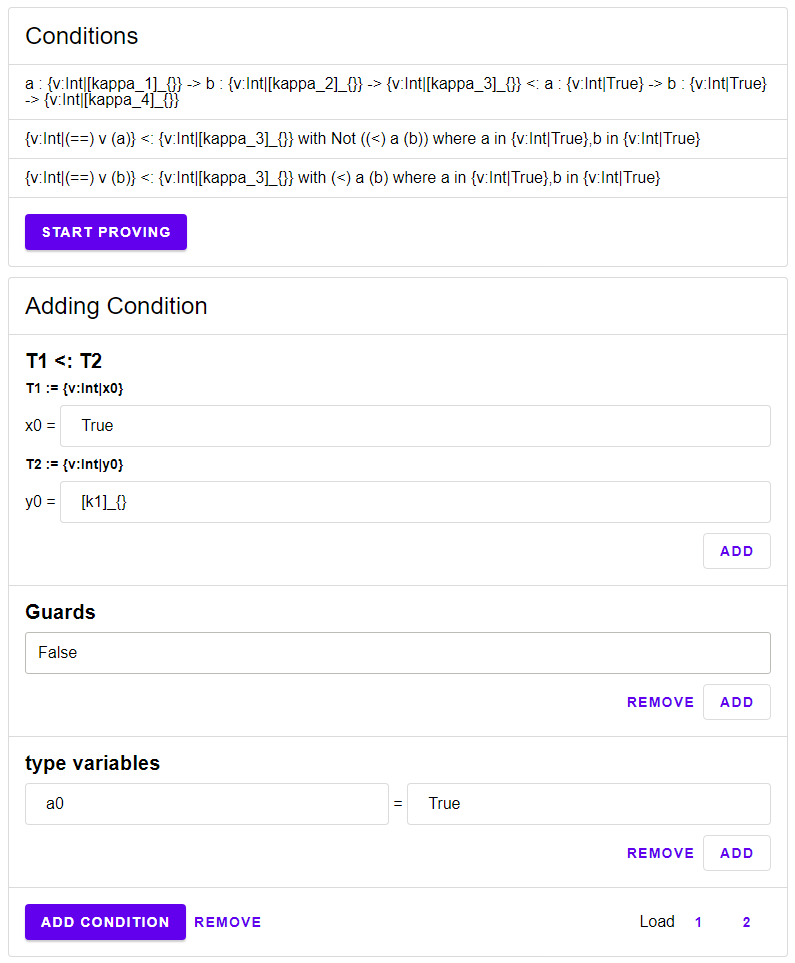

\setcounter{section}{4}
\setcounter{subsection}{4}

## Implementation in Elm

We will now turn to the implementation of the core of the type inference algorithm discussed in the last section.

In particular we will present the `split`, `solve` and `weaken` functions for computing the strongest refinements for a set of given subtyping conditions.

We have implemented these functions in Elm itself; to simplify testing, we have equipped the implementation with a GUI by using an Em package written by the author called Elm-Action \cite{elmAction}. See Figure \@ref(fig:gui).

```{r gui, echo=FALSE, fig.align='center', fig.cap="A GUI for writing a set of input conditions.", out.width = '50%', eval=TRUE}

```

Elm is an immutable pure functional language. The architecture of a typical elm program is similar to that of a state machine: First a `init` function is called to define the initial state (In Elm typically called `Model`), then different messages (like a result of an SMT Solver) can cause a call to an `update` function that updates the current state. Each time the update function is called, it afterwards passes the new state to a `view` function that displays the state as HTML on the screen. Our libary Elm-Action simplifies the wiring to combine multiple Elm programs into one. To do so, the library models the different Elm programs as different states of a meta-level state machine: Each state is its own state machine. To transition from one program into another we define a transition function that takes some transition data as an input and returns the initial state of the new elm program.

In our case, we have three elm programs representing different phases, called `Setup`, `Assistant` and `Done`. The `Setup` program handles the creation of our conditions. The `Assistant` program applies the `split`, `solve` and `weaken` functions to the conditions. The `Done` program shows the solution. We will only discuss the `Assistant` program, as it is the most interesting. In this program our state describes a satisfiability problem. This SAT problem needs to be solved by either the SMT solver or a human. We are using Z3 as SMT Solver. To talk to Z3 we use a small Javascript code that communicated between Z3 and Elm. Elm will send the problem in question through Javascript to Z3 and then awaits a response. Once the response has been recieved, it will then be sent to the `update` function, resulting in a new satisfiability problem. This new problem can the be again send to either Z3 or displayed on the screen. If this process stops, then the program ends and transitions into the `Done` program.

### Types

For Liquid Types we use the following representation:

```
type alias LiquidType a b =
    ( List
        { name : String
        , type : a
        }
    , b
    )
```

A function $a:\{\mathit{Int}|r1\}\to b:\{\mathit{Int}|r2\}\to\{\mathit{Int}|r3\}$ would be represented as `([{name=a,refinement=r1},{name=b,refinement=r2}],r3)`.
We allow different types for  `a` and `b`:

```
type SimpleLiquidType
    = IntType Refinement
    | LiquidTypeVariable Template
```

Possible types for `a` and `b` are either the most general `SimpleLiquidType` or the more specific types `Refinement` and `Template`. Note on the naming: `SimpleLiquidType` is "simple" in the sense that it is not a function type.

In respect to conditions we have two types:

```
type alias Condition =
    { smaller : LiquidType Template SimpleLiquidType
    , bigger : LiquidType Refinement Template
    , guards : List Refinement
    , typeVariables : List ( String, Refinement )
    }


type alias SimpleCondition =
    { smaller : SimpleLiquidType
    , bigger : Template
    , guards : List Refinement
    , typeVariables : List ( String, Refinement )
    }
```

`SimpleCondition` is the implementation of $\mathcal{C}^-$.

### Transition

The `Assistant` program starts by obtaining some transition data from the `Setup` program. This transition data will then be used to initiate the state.

```
type alias Transition =
    List SimpleCondition
```

 We obtain simple conditions from the `split` function. This is a one-to-one implementation of the  _split_ function previously described. We will now go through its definition.
 
\text{\textemdash}

```
split : Condition -> Result () (List SimpleCondition)
split =
  let
    rec : Int -> Condition -> Result () (List SimpleCondition)
    rec offset condition =
      case ( condition.smaller, condition.bigger ) of
        ( ( q1 :: t2, t2end ), ( q3 :: t4, t4end ) ) ->
          if q1.name == q3.name then
            rec (offset + 1)
              { condition
              | smaller = ( t2, t2end )
              , bigger = ( t4, t4end )
              , typeVariables =
                ( q3.name, q3.refinement )
                  :: condition.typeVariables
              }
              |> Result.map
                ((::)
                  { smaller = IntType q3.refinement
                  , bigger = q1.refinement
                  , guards = condition.guards
                  , typeVariables = condition.typeVariables
                  }
                )

          else
            Err ()
```

This first case is equivalent to the following.

$$
\begin{aligned}
&\text{Split}(a:\{\nu:\mathit{Int}|q_1\}\to \hat{T}_2<:_{\Theta,\Lambda}a:\{\nu:\mathit{Int}|q_3\}\to\hat{T}_4 )=\\
&\quad\quad\{\{\nu:\mathit{Int}|q_3\} <:_{\Theta,\Lambda}\{\nu:\mathit{Int}|q_1\}\}\cup\text{Split}(\hat{T}_2 <:_{\Theta\cup\{(a,q_3)\},\Lambda}\hat{T}_4\})
\end{aligned}
$$

\text{\textemdash}

```
        ( ( [], q1 ), ( [], q2 ) ) ->
          [ { smaller = q1
            , bigger = q2
            , guards = condition.guards
            , typeVariables = condition.typeVariables
            }
          ]
            |> Ok
```
The second case is a direct transformation from a `Condition` into a `SimpleCondition`. For our formal definition of the second case, this is equivalent to the identity.

$$
\begin{aligned}
&\text{Split}(\{\nu:\mathit{Int}|q_1\}<:_{\Theta,\Lambda}\{\nu:\mathit{Int}|q_2\} )=\\
&\quad\quad\{ \{\nu:\mathit{Int}|q_1\}<:_{\Theta,\Lambda}\{\nu:\mathit{Int}|q_2\} \}
\end{aligned}
$$

\text{\textemdash}

```
        _ ->
          Err ()
  in
  rec 0
```

The _split_ function is a partial function, therefore we will return an error if neither case could be applied. If so, the `Setup` program will throw an error and the user would need to correct the given conditions. For a valid condition, the _split_ function will always be successful. Once successful the new list of `SimpleCondition`s will be passed as transition data to the `Assistant`
program.

```
case model.conditions |> List.map function.split |> Result.combine of
    Ok conds ->
        conds |> List.concat |> Action.transitioning
    Err () ->
        ...
```

### Init

After we have split the conditions, we initiate the Elm program. Note that this program will be implementing the `solve` and `weaken` functions.

```
init : Transition -> ( Model, Cmd Msg )
init conditions =
    let
        initList =
            (conditions
                |> List.map
                    (\{ typeVariables } ->
                        typeVariables
                            |> List.map (\( name, _ ) -> name)
                    )
                |> List.concat
            )
                |> Refinement.init
    in
    ( { conditions = conditions |> Array.fromList
      , predicates =
            conditions
                |> List.concatMap Condition.liquidTypeVariables
                |> List.map (\v -> ( v, initList |> Array.fromList ))
                |> Dict.fromList
      , index = 0
      , weaken = Nothing
      , auto = False
      , error = Nothing
      }
    , Cmd.none
    )
```

We now go through all fields of our model.

 * `conditions` contains a copy of the conditions.
 * `predicates` contains a dictionary, mapping every liquid type variable to the initial set of predicates $\mathit{Init}(V)$. (Equivalent to `Refinement.init`)
 * `index` contains the index of the current condition. Keep in mind, that the loop from the Solve function is actually modelled as state transitions. Therefore, we can assume that we are always investigating one specific condition at a time. If not, then the program would have already stopped.
 * `weaken` says if we are currently weakening a condition. If this is set to `Nothing` then we are in the `solve` function, else its `Just i` where `i` is the index of the predicate that we are currently investigating.
 * `auto` is a boolean expression that says if the SMT solver should be asked directly. If set to `False`, then the user may decide the satisfiability of the current SMT statement.
 * `error` contains any error message that should be displayed to the user. These errors come directly from the SMT solver.
 
### Update
 
```
update : (String -> Cmd msg) -> Msg -> Model -> Update msg
update sendMsg msg model =
    case msg of
        GotResponse bool ->
            handleResponse sendMsg bool { model | error = Nothing }
        ...

handleResponse : (String -> Cmd msg) -> Bool -> Model -> Update msg
handleResponse sendMsg bool model =
    case model.weaken of
        Just weaken ->
            handleWeaken weaken sendMsg bool model

        Nothing ->
            handleSolve sendMsg bool model
```


We have stored the additional information needed for the `weaken` function in `model.weaken`.
We therefore check the content of `model.weaken`. We check the content of `model.weaken`, If it is `Nothing` we know that we are in the `solve` function, else we know that we are currently in the `weaken` function.

#### The Solve function

```
handleSolve : (String -> Cmd msg) -> Bool -> Model -> Update msg
handleSolve sendMsg bool model =
    if bool then
        --Start weaking
        case
            model.conditions
                |> Array.get model.index
        of
            Just { bigger } ->
                { model
                    | weaken =
                        Just
                            { index = 0
                            , liquidTypeVariable = bigger |> Tuple.first
                            }
                }
                    |> handleAuto sendMsg

            Nothing ->
                Action.updating ( model, Cmd.none )
```

If the incoming result is `True` it means that the SMT statement is satisfiable. Therefore, we start the `weaken` function. To do so, we initiate the weakening index at `0` and also store the liquid type variable whose corresponding refinement we want to weaken.

\text{\textemdash}

```
    else
        --Continue
        let
            index =
                model.index + 1
        in
        if index >= (model.conditions |> Array.length) then
            Action.transitioning
                { conditions = model.conditions
                , predicates =
                    model.predicates
                        |> Dict.map 
                          (\_ -> Array.toList >> Refinement.conjunction)
                }

        else
            { model
                | index = index
            }
                |> handleAuto sendMsg
```

If the incoming result is `False`, then we check out the next condition. If there exists no following condition, then the function is done. We end the Elm program by transitioning into the `Done` program.

#### The Weaken function

```
handleWeaken :
    { index : Int
    , liquidTypeVariable : Int
    }
    -> (String -> Cmd msg)
    -> Bool
    -> Model
    -> Update msg
handleWeaken weaken sendMsg bool model =
    if bool then
        --Remove
        let
            predicates =
                model.predicates
                    |> Dict.update weaken.liquidTypeVariable
                        (Maybe.map
                            (Array.removeAt weaken.index)
                        )
        in
        if
            weaken.index
                >= (predicates
                        |> Dict.get weaken.liquidTypeVariable
                        |> Maybe.map Array.length
                        |> Maybe.withDefault 0
                   )
        then
            { model
                | predicates = predicates
                , weaken = Nothing
                , index = 0
            }
                |> handleAuto sendMsg

        else
            { model
                | predicates = predicates
            }
                |> handleAuto sendMsg
```

If the incoming result is `False` then the SMT statement is unsatifiable. Thus, we remove the predicate. If no predicate exists, we finish the `weaken` function by setting `model.weaken` to `Nothing`.

\text{\textemdash}

```
    else
        --Continue
        let
            index =
                weaken.index + 1
        in
        if
            index
                >= (model.predicates
                        |> Dict.get weaken.liquidTypeVariable
                        |> Maybe.map Array.length
                        |> Maybe.withDefault 0
                   )
        then
            { model
                | weaken = Nothing
                , index = 0
            }
                |> handleAuto sendMsg

        else
            { model
                | weaken =
                    Just
                        { liquidTypeVariable = weaken.liquidTypeVariable
                        , index = index
                        }
            }
                |> handleAuto sendMsg
```

If the incoming result is `True` then the SMT statement is satisfiable. We therefore check out the next predicate. We finish the function if no following predicate exists. To do so we again set `model.weaken` to `Nothing`.

### SMT Statement

After every update we check if the SMT statement should be automatically sent to the SMT solver.

```
handleAuto : (String -> Cmd msg) -> Model -> Update msg
handleAuto sendMsg model =
    if model.auto then
        ( model
        , model
            |> smtStatement
            |> Maybe.map sendMsg
            |> Maybe.withDefault Cmd.none
        )
            |> Action.updating

    else
        Action.updating
            ( model, Cmd.none )
```

If not, it will be displayed on the screen. Either way we need to compute the SMT statement for the given model.

```
smtStatement : Model -> Maybe String
smtStatement model =
    let
        toString : SimpleCondition -> String
        toString condition =
            case model.weaken of
                Just weaken ->
                    statementForWeaken weaken model condition

                Nothing ->
                    statementForSolve model condition
    in
    model.conditions
        |> Array.get model.index
        |> Maybe.map toString
```

The statement differes between the `solve` and the `weaken` function.

#### SMT Statement for Solve

For the `solve` function we translate the condition directly into the SMT statement.

```
statementForSolve : Model -> SimpleCondition -> String
statementForSolve model condition =
    condition
        |> Condition.toSMTStatement
            (model.predicates
                |> Dict.map (\_ -> Array.toList >> Refinement.conjunction)
            )
```

The actual translation happens in `Condition.toSMTStatement`. The translation is taken directly from the described `solve` function. We therefore will now compare both with another.

\text{\textemdash}

```
toSMTStatement : Dict Int Refinement -> SimpleCondition -> String
toSMTStatement dict { smaller, bigger, guards, typeVariables } =
    let
        typeVariablesRefinements : List Refinement
        typeVariablesRefinements =
            typeVariables
                |> List.map
                    (\( b, r ) ->
                        r |> Refinement.rename 
                            { find = "v"
                            , replaceWith = b
                            }
                    )
```
This equivalent to the following.

$$
\begin{aligned}
&\text{Let}\\
&\begin{aligned}
  \Theta':= \{\ (&a,r)\\
   | \ &r \text{ has the form } q \land (a,q)\in\Theta \land q\in\mathcal{Q}\\
  \lor \ &r \text{ has the form } [[k]_S]_{S_0}\land (a,q)\in\Theta\\
  &\quad\land q \text{ has the form } [k]_{S_0} \land k\in\mathcal{K} \land S_0\in\mathcal{V}\nrightarrow\mathit{IntExp}\}
  \end{aligned}\\
&\{(b_1,r_1'),\dots,(b_n,r_n')\}=\Theta'\\
&\text{in}
\bigwedge_{j=0}^n [r_j']_{\{(\nu,b_j)\}}
\end{aligned}
$$

\text{\textemdash}

```
        r1 : Refinement
        r1 =
            case smaller of
                IntType refinement ->
                    refinement

                LiquidTypeVariable ( int, list ) ->
                    list
                        |> List.foldl
                            (\( k, v ) ->
                                Refinement.substitute
                                    { find = k
                                    , replaceWith = v
                                    }
                            )
                            (dict
                                |> Dict.get int
                                |> Maybe.withDefault IsFalse
                            )
```

Here we have a case distinction between a refinement and a liquid type variable. We had the same distinction in our original definition of $r1$:

$$
r_1 := \begin{cases}\bigwedge [S(k_1)]_{S_1}&\text{if } q_1 \text{ has the form } [k_1]_{S_1} \text{ for } k\in\mathcal{K}\text{ and } S_1\in\mathcal{V}\nrightarrow\mathit{IntExp}\\
q_1& \text{if }q_1\in\mathcal{Q}
\end{cases},\\
$$

\text{\textemdash}

```
        r2 : Refinement
        r2 =
            bigger
                |> Tuple.second
                |> List.foldl
                    (\( k, v ) ->
                        Refinement.substitute
                            { find = k
                            , replaceWith = v
                            }
                    )
                    (dict
                        |> Dict.get (bigger |> Tuple.first)
                        |> Maybe.withDefault IsFalse
                    )
```

Here we see how we apply the lazy substitution (stored in `bigger |> Tuple.second`). In the original definition we assumed that we know how to apply a substitution on term level:

$$
r_2 := \bigwedge [S(\kappa_2)]_{S_2}
$$

\text{\textemdash}

```
        statement : Refinement
        statement =
            (r1
                :: typeVariablesRefinements
                ++ guards
            )
                |> List.foldl AndAlso (IsNot r2)
    in
    (statement
        |> Refinement.variables
        |> Set.toList
        |> List.map (\k -> "(declare-const " ++ k ++ " Int)\n")
        |> String.concat
    )
        ++ ("(assert " 
               ++ (statement |> Refinement.toSMTStatement) 
               ++ ")\n(check-sat)"
           )
```

The final statement is therefore

$$((\bigwedge_{j=0}^n [r_j']_{\{(\nu,b_j)\}})\land r_1\land p)\land \neg r_2$$
with free variables $\nu\in\mathbb{Z}$ and $b_i\in\mathbb{Z}$ for $i\in\mathbb{N}_1^n$.

#### SMT Statement for Weaken

For the `weaken` function we modify the statement.

```
statementForWeaken :
    { index : Int, liquidTypeVariable : Int }
    -> Model
    -> SimpleCondition
    -> String
statementForWeaken weaken model condition =
  condition
    |> Condition.toSMTStatement
      (model.predicates
        |> Dict.map (\_ -> Array.toList >> Refinement.conjunction)
        |> Dict.update (condition.bigger |> Tuple.first)
          (Maybe.map
            (\_ ->
              model
                |> getLazySubstitute
                |> List.foldl
                  (\( find, replaceWith ) ->
                    Refinement.substitute
                      { find = find
                      , replaceWith = replaceWith
                      }
                  )
                  (model.predicates
                    |> Dict.get (condition.bigger |> Tuple.first)
                    |> Maybe.andThen (Array.get weaken.index)
                    |> Maybe.withDefault IsFalse
                  )
            )
          )
      )
```

We replace the value at the point `condition.bigger |> Tuple.first` with the predicate in question. The same happens in our formal definition. The resulting SMT statement for the predicate $q$ is therefore

$$((\bigwedge_{j=0}^n [r_j']_{\{(\nu,b_j)\}})\land r_1\land p)\land \neg q$$
with free variables $\nu\in\mathbb{Z}$ and $b_i\in\mathbb{Z}$ for $i\in\mathbb{N}_1^n$.

We therefore swap the result around: We keep the predicate if we SMT statement is unsatifiable. This is equivalent to saying we keep the predicate if the negated SMT statement is satifiable:

$$\neg((\bigwedge_{j=0}^n [r_j']_{\{(\nu,b_j)\}})\land r_1\land p)\lor q
$$
with free variables $\nu\in\mathbb{Z}$ and $b_i\in\mathbb{Z}$ for $i\in\mathbb{N}_1^n$.

