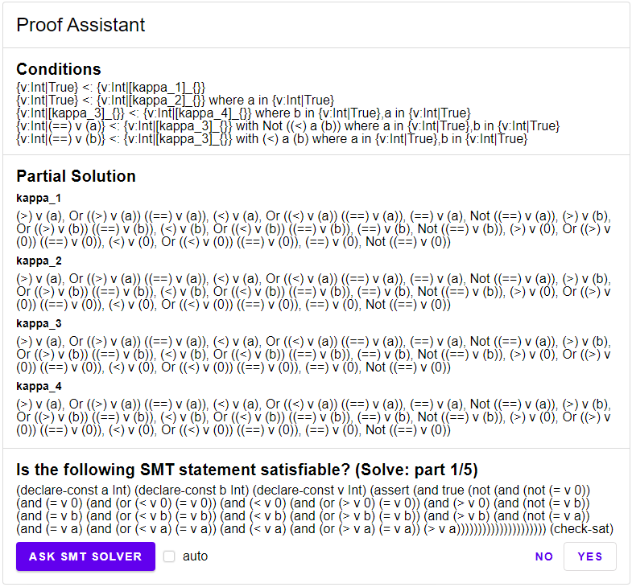
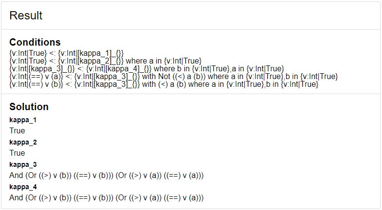

## Refinement Types in Elm

We will now turn to the implementation of the core of the type inference algorithm discussed in Section \@ref(formulating-smt-statements) previous chapter.

In particular, we will present the `split`, `solve` and `weaken` functions for computing the strongest refinements for a set of given subtyping conditions.

We have implemented these functions in Elm itself; to simplify testing, we have equipped the implementation with a GUI by using an Em package written by the author called Elm-Action \cite{elmAction} (see Figure \@ref(fig:gui)).

```{r gui, echo=FALSE, fig.align='center', fig.cap="A GUI for writing a set of input conditions.", out.width = '50%', eval=TRUE}
knitr::include_graphics("ui.png")
```

The architecture of a typical elm program is similar to that of a state machine: First a `init` function is called to define the initial state (in Elm typically called `Model`). The state is then passed to the `view` function that displays the state as an HTML document on the screen. The user can now interact with the elements on screen (like pressing a button). Once the user has performed an interaction, a message describing the action will be passed to an `update` function, updating the current state (and with that also the HTML document on screen).

Our implementation consists of three different programs called `Setup`, `Assistant` and `Done`. The `Setup` program as seen in Figure \@ref(fig:gui) handles the creation of our conditions. The `Assistant` program as seen in Figure \@ref(fig:assistant) applies the `split`, `solve` and `weaken` functions to the conditions. The `Done` program as seen in Figure \@ref(fig:done) shows the solution. 

```{r assistant, echo=FALSE, fig.align='center', fig.cap="Proof assistant displaying the current SMT statement", out.width = '50%', eval=TRUE}

```

```{r done, echo=FALSE, fig.align='center', fig.cap="The end result", out.width = '50%', eval=TRUE}

```

Our library Elm-Action simplifies the wiring to combine multiple Elm programs into one. To do so, the library models the different Elm programs as different states of a meta-level state machine: Each state is its own state machine. To transition from one program into another we define a transition function that takes some transition data as an input and returns the initial state of the new elm program.

We will only discuss the `Assistant` program, as it is the most interesting. In this program our state describes a satisfiability problem. This SAT problem needs to be solved by either the SMT solver or a human. We are using the SMT solver called Z3. To talk to Z3, we use a small JavaScript code that communicates between Z3 and Elm. Elm will send the problem in question through JavaScript to Z3 and then awaits a response. Once the response has been received, it will then be sent to the `update` function, resulting in a new satisfiability problem. This new problem can be again sent to either Z3 or displayed on the screen. If this process stops, then the program ends and transitions into the `Done` program.

