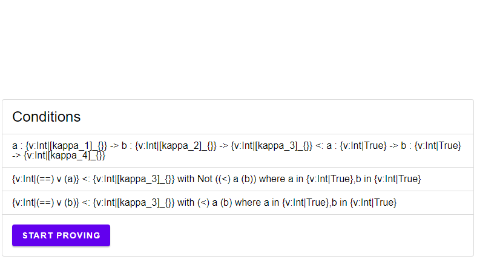
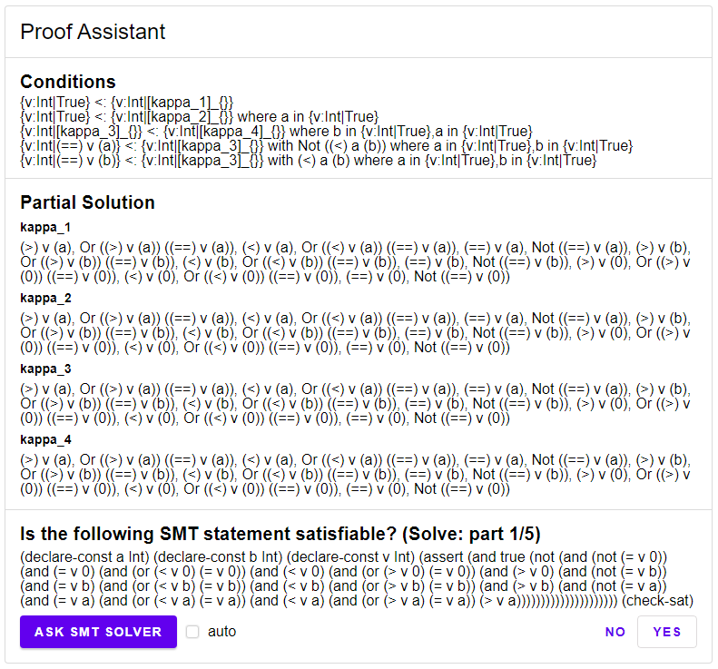
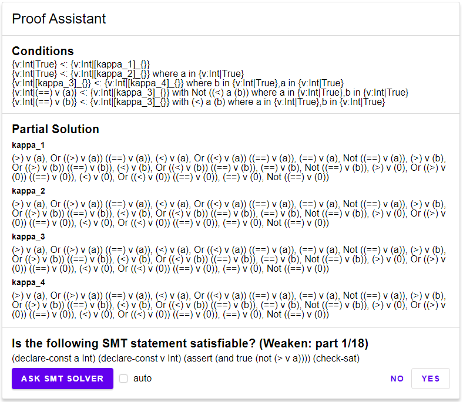
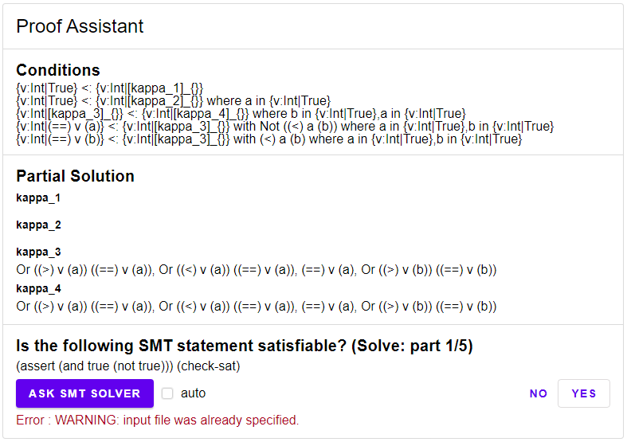

\setcounter{section}{5}
\setcounter{subsection}{3}

## Demonstration

For this demonstration we will consider the following function.

```
max : a:{ v:Int|True } -> b:{ v:Int|True } -> { v:Int|k4 };
max =
  \a -> \b ->
    if 
      (<) a b
    then
      b
    else
      a
```

To check the validity of the type signature, we will first infer the type of the function and then compare it with the type signature. Using the Inference rule, we obtain as a result the type

$$
\{v:\mathit{Int}|\kappa_1\} \to \{v:\mathit{Int}|\kappa_2\} \to \{v:\mathit{Int}|\kappa_3\}
$$

with the following conditions.

$$
\begin{aligned}
\{\nu:\mathit{Int}|\nu = b\}&<:_{\{(a,\{\mathit{Int}|\mathit{True}\}),(b,\{\mathit{Int}|\mathit{True}\})\},\{a < b\}}\{\nu:\mathit{Int}|\kappa_3\},\\
  \{\nu:\mathit{Int}|\nu = a\}&<:_{\{(a,\{\mathit{Int}|\mathit{True}\}),(b,\{\mathit{Int}|\mathit{True}\})\},\{\neg (a < b)\}}\{\nu:\mathit{Int}|\kappa_3\},
\end{aligned}
$$

We now write the validity check of the type signature as a condition.

$$
\begin{aligned}
  & a:\{\nu:\mathit{Int}|\kappa_1\}\to b:\{\nu:\mathit{Int}|\kappa_2\}\to\{\nu:\mathit{Int}|\kappa_3\}\\
  &\quad<:_{\{\},\{\}}a:\{\nu:\mathit{Int}|\mathit{True}\}\to b:\{\nu:\mathit{Int}|\mathit{True}\}\to\{\nu:\mathit{Int}|\kappa_4\}\\
\end{aligned}
$$

Figure \@ref(fig:assistant1) shows how the conditions can be inserted into the elm program.

```{r assistant1, echo=FALSE, fig.align='center', fig.cap="The conditions of the max-function", out.width = '75%', eval=TRUE}

```

If we click on the "Start Proving" button, the `Assistant` program will start and get the list of conditions as the transition data. It now applies the `split` function to the conditions and computes the first SMT statement, as seen in Figure \@ref(fig:assistant2).

```{r assistant2, echo=FALSE, fig.align='center', fig.cap="The conditions of the max-function", out.width = '75%', eval=TRUE}

```

Here we see the conditions on top, displaying the conditions that are now split. Next we see that for each `kappa` the set of predicated have been initiated with all possible predicates for variables `a` and `b`. Below it presents the first SMT statement in the `Solve`-step, mainly if the first condition is not satisfiable for the current value of `kappa_1`. Therefore, the SMT statement is satisfiable.

Next program goes into the `Weaken`-step as starts checking each and every predicate currently associated with `kappa_1`, as seen in Figure \@ref(fig:assistant3).

```{r assistant3, echo=FALSE, fig.align='center', fig.cap="Weakening the predicates.", out.width = '75%', eval=TRUE}

```

Once it has checked every predicate, it goes back to the `Solve`-step and repeats. In Figure \@ref(fig:assistant4) you can see the result after a few iterations.

```{r assistant4, echo=FALSE, fig.align='center', fig.cap="Weakening the predicates.", out.width = '75%', eval=TRUE}

```

Once every condition is valid (meaning that all SMT statements in the `Solve`-step are unsatifiable) the program holds and the result is displayed as seen in Figure \@ref(fig:done).  